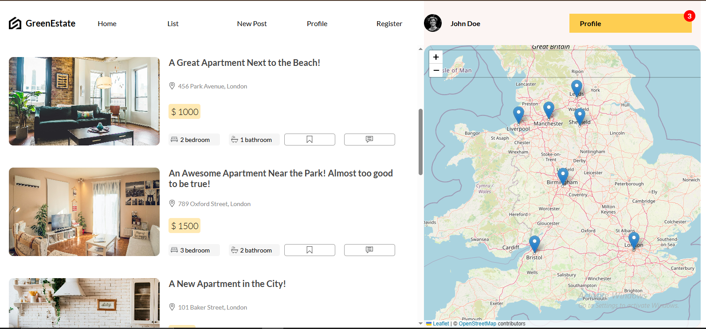
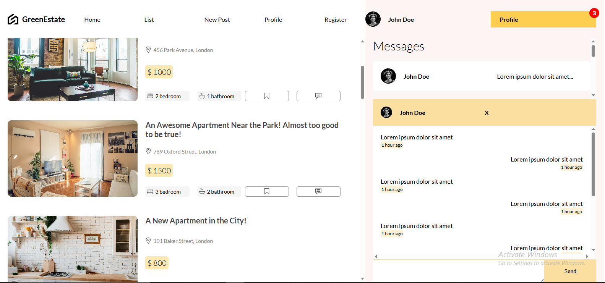

# 🏠 Real Estate Platform

A modern real estate web app designed to showcase property listings with clean UI, filtering, and responsive design.

**Live Demo:** https://real-estate-ten-gray.vercel.app/

---

## 🧩 Overview

This project is a frontend application for a real estate listing platform. It provides users with a smooth, intuitive interface to browse properties, view details, and explore real estate options.

The goal is to combine **usability**, **performance**, and **visual appeal**, giving users a trustworthy experience when looking for homes or rentals.

---

## 🔍 Key Features

- 📋 **Property Listings** – Grid or card layout of properties with images, locations, prices
- 🏡 **Property Detail Pages** – Full view with gallery, description, amenities, map view
- 🔎 **Filtering & Search** – Filter by price, location, property type, etc.
- 📱 **Responsive Design** – Works well on desktop, tablet, and mobile
- 🧩 **Modular Components** – Reusable UI elements for listings, forms, cards, etc.
- ⚡ **Fast Loading** – Optimized for performance and smooth transitions

---

## 🛠 Tech Stack

Here are the main technologies (you can modify or add more):

- **Framework**: React Js
- **Styling**: Tailwind CSS or your choice of CSS solution
- **State / Logic**: React state, Context, or another state library
- **Maps & UI**: (e.g. Google Maps, Leaflet, or an interactive map library)
- **Deployment**: Vercel

---

## 📸 Screenshots / Preview

| Screen                | Preview                              |
| --------------------- | ------------------------------------ |
| Property Listing Page |  |
| Property Detail Page  |   |

---

## 🚀 Getting Started

1. **Clone the Repo**
   ```bash
   git clone https://github.com/your-username/real-estate-app.git
   cd real-estate-app
   ```
